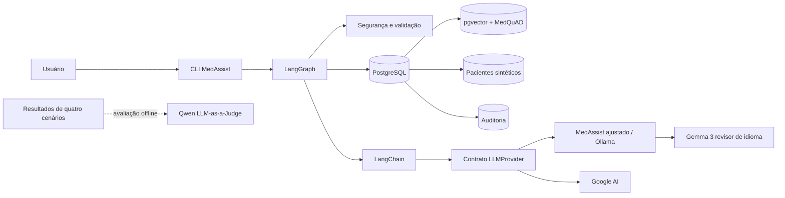
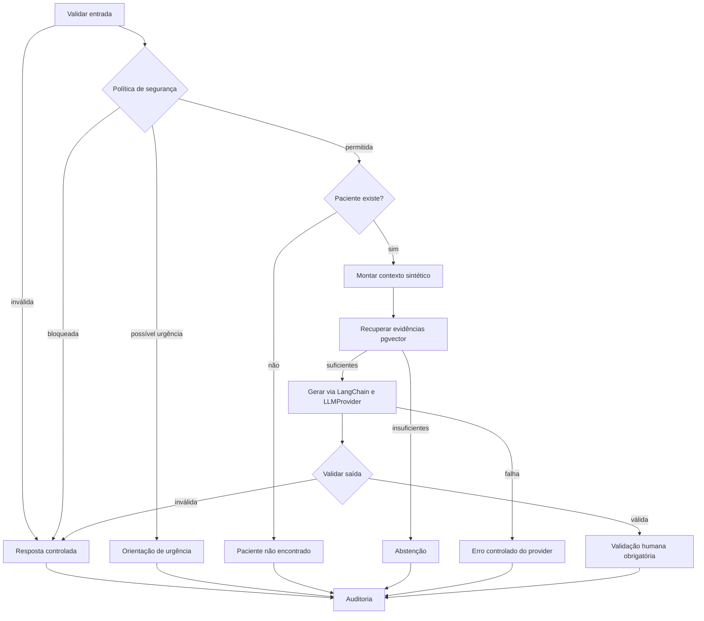

# Diagramas do MedAssist

Este documento centraliza somente as duas visualizações necessárias para compreender o sistema. A primeira mostra responsabilidades e integrações; a segunda detalha as decisões executadas em uma requisição. Gráficos de resultados permanecem junto ao relatório de avaliação.

## 1. Visão estrutural

O diagrama separa entradas, orquestração, dados e modelos. O Qwen aparece fora do caminho de atendimento porque atua somente na avaliação offline.

## 2. Fluxo seguro do LangGraph

Cada saída passa por uma decisão explícita. Rotas interrompidas seguem diretamente para auditoria; somente uma resposta fundamentada chega à validação humana obrigatória.

