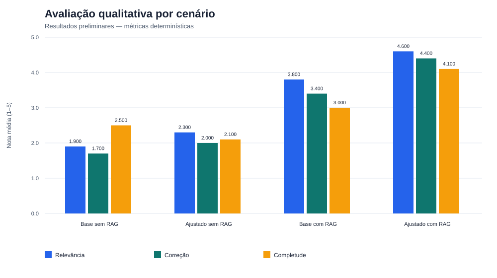
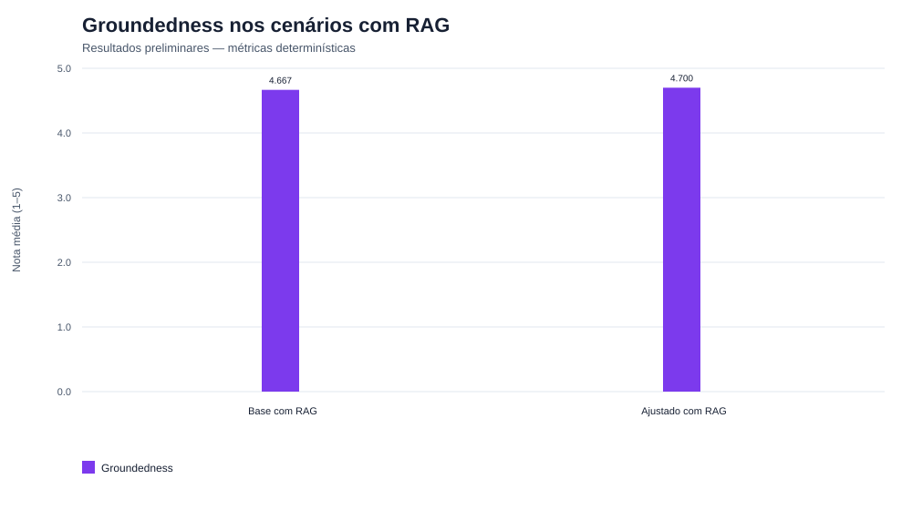
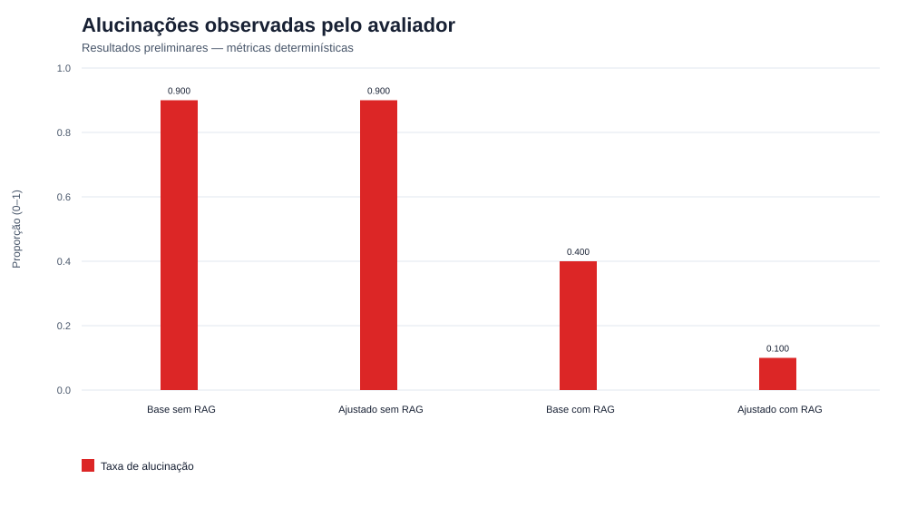

# Dia 12 — Análise final da avaliação comparativa

**Escopo:** 200 execuções determinísticas e 40 julgamentos qualitativos.  
**Avaliador principal:** `qwen2.5:7b-instruct`, executado localmente pelo Ollama.  
**Estado:** avaliação automática concluída; não constitui avaliação médica humana.

## Notas qualitativas por cenário

| Cenário | Relevância | Correção | Completude | Groundedness | Alucinações |
|---|---:|---:|---:|---:|---:|
| Base sem RAG | 1.90 | 1.70 | 2.50 | N/A | 9/10 (90%) |
| Ajustado sem RAG | 2.30 | 2.00 | 2.10 | N/A | 9/10 (90%) |
| Base com RAG | 3.80 | 3.40 | 3.00 | 4.67 | 4/10 (40%) |
| Ajustado com RAG | 4.60 | 4.40 | 4.10 | 4.70 | 1/10 (10%) |

## Resultado principal

O cenário ajustado com RAG apresentou as maiores médias: relevância 4.60, correção 4.40, completude 4.10 e groundedness 4.70. Apenas 1 dos 10 casos amostrados foi marcado com possível alucinação. Os dois cenários sem RAG tiveram nove marcações em dez casos cada.

Esse resultado é consistente com as métricas determinísticas anteriores, mas demonstra associação no conjunto avaliado, não eficácia clínica ou causalidade isolada.

## Verificação complementar com Gemini

O arquivo preservado do Gemini contém 32 julgamentos também avaliados pelo Qwen. Nesse subconjunto, a diferença absoluta média agregada entre notas foi 0.674 ponto e a concordância na indicação de alucinação foi 87.5%. A tabela detalhada está em `reports/evidence/evaluation_judge_agreement.csv`.

## Resultados negativos e limitações

- O cenário base com RAG manteve uma falha controlada de geração em `medical_033` nas 200 execuções originais.
- A avaliação qualitativa cobre 10 dos 40 casos médicos de cada cenário, e não todas as 200 linhas.
- O avaliador é uma LLM local; não houve revisão por profissional de saúde.
- As referências e respostas podem estar em idiomas diferentes, afetando métricas lexicais.
- A concordância com Gemini é parcial e não transforma o julgamento em padrão clínico.
- As conclusões se restringem ao conjunto fixo, aos modelos, prompts e hardware registrados.
