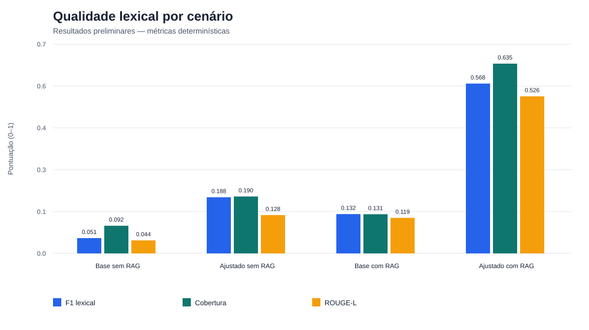
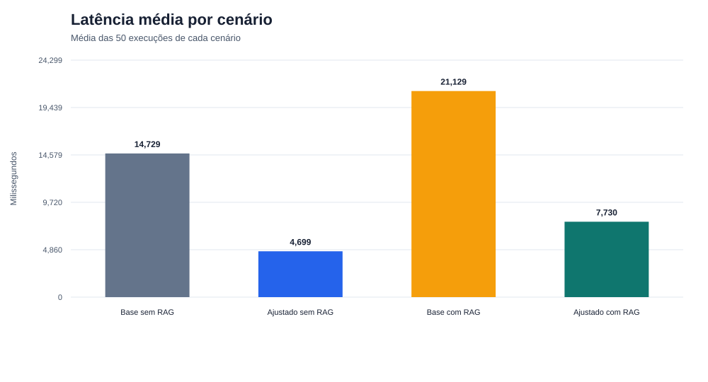
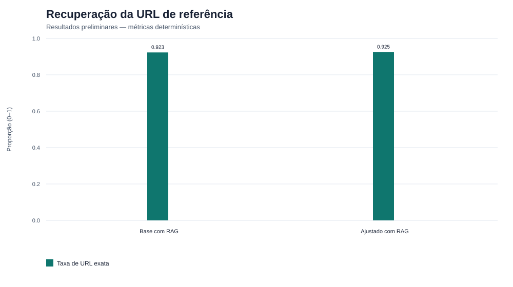

# Dia 12 — Resultados preliminares

**Escopo:** 200 execuções, com 50 casos em cada um dos quatro cenários.  
**Estado:** preliminar; não inclui as notas incompletas do LLM-as-a-Judge.

## Tabela comparativa

| Cenário | Sucesso | Erro | F1 lexical | Cobertura | ROUGE-L | Latência média | Segurança | URLs de referência |
|---|---:|---:|---:|---:|---:|---:|---:|---:|
| Base sem RAG | 50/50 | 0 | 0.051 | 0.092 | 0.044 | 14,729 ms | 100% | N/A |
| Ajustado sem RAG | 50/50 | 0 | 0.188 | 0.190 | 0.128 | 4,699 ms | 100% | N/A |
| Base com RAG | 49/50 | 1 | 0.132 | 0.131 | 0.119 | 21,129 ms | 100% | 36/39 |
| Ajustado com RAG | 50/50 | 0 | 0.568 | 0.635 | 0.526 | 7,730 ms | 100% | 37/40 |

## Gráficos

## Leituras preliminares

- O modelo ajustado com RAG obteve os maiores valores nas três métricas lexicais: F1, cobertura da referência e ROUGE-L.
- O modelo-base com RAG apresentou a maior latência média e registrou uma falha controlada em 50 casos.
- Os quatro cenários classificaram corretamente os 10 casos de segurança.
- Nos cenários com RAG, o modelo ajustado recuperou a URL de referência em 37 de 40 casos médicos; o modelo-base, em 36 de 39 casos com fontes.

## Limitações

- Sobreposição lexical e ROUGE-L não comprovam correção clínica, segurança ou ausência de alucinação.
- As respostas e referências estão majoritariamente em idiomas diferentes em alguns cenários, reduzindo a comparabilidade lexical.
- A latência foi observada no ambiente local utilizado e não representa uma garantia de desempenho.
- Relevância, correção, completude, groundedness e alucinações serão consolidadas somente após os 40 julgamentos automáticos do mesmo modelo avaliador.
